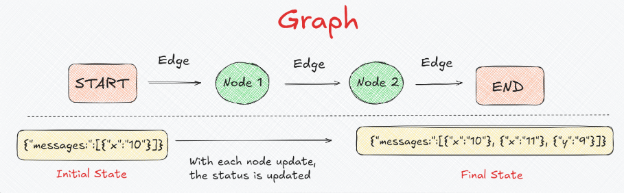
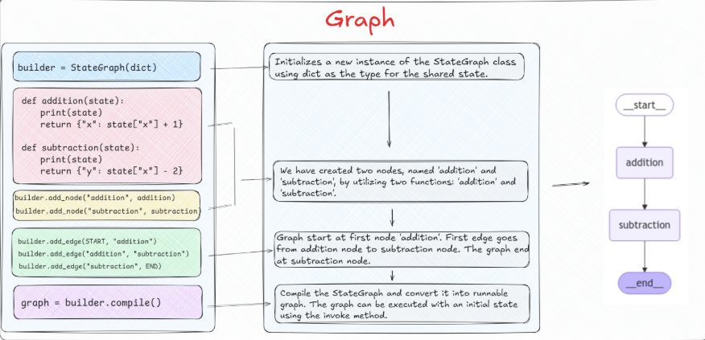
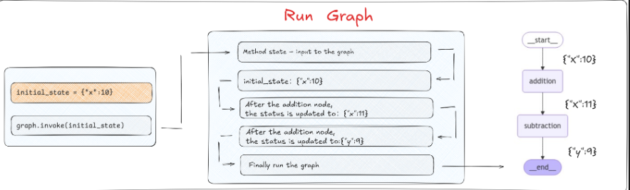
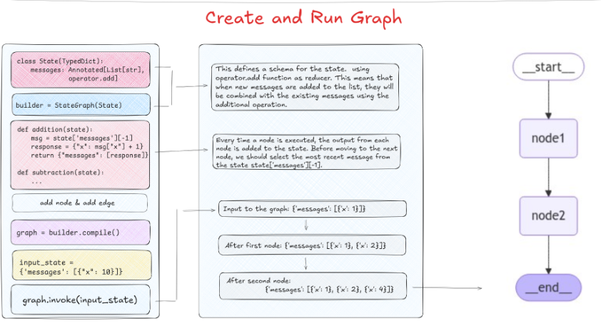

# 引言
LangGraph的底层图算法采用**消息传递机制**来定义和执行图中的交互流程，其中`State`组件扮演着关键的载体角色，负责在图的各个节点间传递信息。
# 1. LangGraph中State的定义模式
### 消息流转过程

简单过一下图中的流程：
```
初始状态: { "x": "10" }
    ↓
Node 1 处理: 对 x 进行操作
    ↓
中间状态: { "x": "10" }, { "x": "11" }
    ↓
Node 2 处理: 基于 x 创建 y
    ↓
最终状态: { "x": "10" }, { "x": "11" }, { "y": "9" }
```
关键特性如下：
1. 每个节点都具备**可访问**、**读取**、**写入**权限
2. 当某个节点修改状态时，它会将此信息广播到图中的所有节点
3. **State实质为一个共享的数据结构**，表现为一个简单的字典
4. 通过对这个字典进行读写操作，可以实现自左而右的数据流动


## 1.1. 使用字典类型定义状态
接下来用代码复现上图的状态设计流程
### 1.1.1. 基础框架
将图的状态设计为一个字典，用于在不同的节点之间**共享**和**修改**数据，然后用`StateGraph`实例化
```python
from langgraph.graph import StateGraph

# 创建图，使用字典作为状态模式
builder = StateGraph(dict)
```
### 1.1.2. 定义节点函数
这里需要定义两个节点
1. `addition`：加法逻辑，接收当前状态并将字典中的值+1
2. `subtraction`：减法逻辑，接收当前状态并将字典中的值-2
```python
# 定义节点
def addition(state):
  print(state)
  return {"x": state["x"] + 1}

def subtraction(state):
  print(state)
  return {"x": state["x"] - 2}
```
### 1.1.3. 构建图结构
接下来添加节点并设置边
```python
from langgraph.graph import START, END

# 添加节点
builder.add_node("addition", addition)
builder.add_node("subtraction", subtraction)

# 添加边
builder.add_edge(START, "addition")
builder.add_edge("addition", "subtraction")
builder.add_edge("subtraction", END)
```
### 1.1.4. 编译和执行图
```python
# 编译图
graph = builder.compile()

# 定义初始状态
initial_state = {"x": 10}

# 执行图
result = graph.invoke(initial_state)
print(result)
```
### 1.1.5. 执行结果
```
{'x': 10}
{'x': 11}
{'x': 9}
```
### 1.1.6. 关键特性
1. **节点函数只需要返回更新的部分**：每个节点的函数内部逻辑中，需要使用和更新哪些State中的参数，只需要在`return`的时候指定即可，不必担心未在当前节点处理的State中的其他值会丢失。

2. **状态隔离性**：状态在任何给定时间只包含来自一个节点的更新信息。这意味着当节点处理状态时，它只能访问与其特定操作直接相关的数据。

3. **字典类型的灵活性**：使用字典作为状态模式非常简单，由于缺乏预定义的模式，节点可以在没有严格类型约束的情况下自由地读取和写入状态。

4. **注意事项**：如果在任何节点中尝试访问State中不存在的键，会直接中断整个图的运行状态。

# 2. Reducer函数机制
## Reducer函数原理
LangGraph的内部原理是：`State`中每一个`key`都有自己独立的`Reducer`函数，通过指定的`reducer`函数应用于状态值的更新

`Reducer`函数用来根据当前的状态（state）和一个操作（action）来计算并返回新的状态。它是一种设计模式，用于将业务逻辑与状态变更解耦，使得状态的变更预测性更强并且容易追踪。

简单来说，`Reducer`就是根据给定的输入(当前状态和操作)生成新的状态。

## 默认行为
若没有显式指定，则对该键的所有更新都执行的是**覆盖**操作。这也解释了为什么上面的执行结果与消息流转过程的内容不一样

接下来请看两段代码，这边把上面的`dict`换回`TypeDict`，`TypeDict`允许我们明确指定每个键的类型，这有助于防止在状态管理过程中出现类型错误。
## 使用TypeDict定义状态
```python
from langgraph.graph import StateGraph, START, END
from typing_extensions import TypedDict

class State(TypedDict):
  x: int
  y: int

builder = StateGraph(State)

def addition(state):
  print(state)
  return {"x": state["x"] + 1}

def subtraction(state):
  print(state)
  return {"y": state["x"] - 2}

builder.add_node("addition", addition)
builder.add_node("subtraction", subtraction)

builder.add_edge(START, "addition")
builder.add_edge("addition", "subtraction")
builder.add_edge("subtraction", END)

graph = builder.compile()

initial_state = {"x": 10}
result = graph.invoke(initial_state)
print(result)
```
执行结果：
```
{'x': 10}
{'x': 11}
{'x': 11, 'y': 9}
```
## 使用Annotated指定Reducer
当我们需要对状态进行更复杂的操作时，可以使用`Annotated`来指定`Reducer`函数：
```python
from langgraph.graph import StateGraph, START, END
from typing_extensions import TypedDict, Annotated, List
import operator

class State(TypedDict):
  # 消息列表，使用operator.add作为reducer函数， 意为在列表后面添加元素
  messages: Annotated[List[str], operator.add]

def addition(state):
  print(state)
  msg = state['messages'][-1] # 取最新的状态
  response = {"x": msg["x"] + 1}
  return {"messages": [response]}

def subtraction(state):
  print(state)
  msg = state['messages'][-1] # 取最新的状态
  response = {"x": msg["x"] - 2}
  return {"messages": [response]}

builder = StateGraph(State)

builder.add_node("addition", addition)
builder.add_node("subtraction", subtraction)

builder.add_edge(START, "addition")
builder.add_edge("addition", "subtraction")
builder.add_edge("subtraction", END)

graph = builder.compile()

initial_state = {"messages": [{"x": 10}]}
result = graph.invoke(initial_state)
print(result)
```
执行结果：
```
{'messages': [{'x': 10}]}
{'messages': [{'x': 10}, {'x': 11}]}
{'messages': [{'x': 10}, {'x': 11}, {'x': 9}]}
```
**说明**：`Annotated`是Python的一个类型提示工具，属于typing模块。它被用来添加额外的信息或元数据到类型提示上。

当定义状态模式的结构发生了变化以后，在节点函数中的读取和存储逻辑也要发生相应的变化：

**Reducers的目的**：在LangGraph框架中的状态管理系统中，允许更灵活地定义状态如何根据各种操作更新。通过指定不同的reducer函数，我们可以控制状态的每个部分应如何响应特定的更新。
# 3. 在图状态中处理消息的思路
## 构建历史对话记录
Reducer机制的一个现实意义是：我们可以基于这种方式去构建历史对话记录。因为目前大多数大模型应用都是接受消息列表作为输入。就像LangChain中的Chat Model，需要接收Message对象列表作为输入。
## 完整示例
下面这个示例，我们进一步将大模型接入到LangGraph工作流程中，并允许动态消息处理以及与模型的交互：
```python
import os
from langchain_core.messages import SystemMessage, HumanMessage
from typing_extensions import TypedDict, Annotated, List
import operator
from langgraph.graph import StateGraph
from langchain_openai import ChatOpenAI

os.environ["OPENAI_API_KEY"] = "sk-xxx" # 填入自己的api_key

llm = ChatOpenAI(
  base_url="https://api.deepseek.com/v1",
  model='deepseek-chat',
  temperature=0
)

class State(TypedDict):
  messages: Annotated[List[str], operator.add]

builder = StateGraph(State)

def chat_with_model(state):
  print(state)
  print("-----------------")
  messages = state['messages']
  response = llm.invoke(messages)
  return {"messages": [response]}

def convert_messages(state):
  EXTRACTION_PROMPT = """
  You are a data extraction specialist tasked with retrieving key information from a text.
  Extract such information for the provided text and output it in JSON format. Outline the key data points extracted.
  """
  print(state)
  print("-----------------")
  messages = [
    SystemMessage(content=EXTRACTION_PROMPT),
    HumanMessage(content=state['messages'][-1].content)
  ]
  response = llm.invoke(messages)
  return {"messages": [response]}

builder.add_node("chat_with_model", chat_with_model)
builder.add_node("convert_messages", convert_messages)

builder.set_entry_point("chat_with_model")
builder.add_edge("chat_with_model", "convert_messages")
builder.set_finish_point("convert_messages")

graph = builder.compile()

query = "你好，请你详细的介绍一下你自己"
result = graph.invoke({"messages": [HumanMessage(content=query)]})
print(result)
```
运行结果：
```
{'messages': [HumanMessage(content='你好，请你详细的介绍一下你自己', additional_kwargs={}, response_metadata={})]}
-----------------
{'messages': [HumanMessage(content='你好，请你详细的介绍一下你自己', additional_kwargs={}, response_metadata={}), AIMessage(content='你好！很高兴认识你！😊\n\n让我详细介绍一下自己：\n\n## 基本信息\n我是**DeepSeek**，由深度求索公司创造的AI助手。我是目前DeepSeek的最新版本模型，专
门设计来帮助用户解决各种问题和需求。\n\n## 核心能力\n- **文本处理**：我专注于文本的生成、理解和分析，可以帮你写作、翻译、总结、分析等\n- **知识问答**：我的知识截止到2024年7月，涵盖广泛领域，可以回答各种问题\n- **逻辑推理**：我擅长逻辑分析、数学计算、编程等问题\n- **创意写作**： 可以帮助创作故事、诗歌、文案等\n\n## 特色功能\n- **文件上传**：支持上传图像、txt、pdf、ppt、word、excel等文件，我可以读取其中的文字信息进行处理\n- **长文本处理**：拥有128K的上下文长度，可以处理很长的对话和文档\n- **联网搜索**：支持联网搜索功能（需要你在Web/App中手动开启）\n\n## 使用方式\n- **完全免费**：目前没有任何收费计划，你可以放心使用\n- **多平台**：可以通过官方应用商店下载App，或在网页端使用\n- **对话风格**：我力求回应热情、细腻，希望给你带来愉快的交流体验\n\n## 我的局限\n- 我是纯文本模型，不支持多模态识别（但可以读取上传文件中的文字）\n- 没有语 音功能\n- 知识更新到2024年7月\n\n有什么具体的问题或任务需要我帮助吗？我很乐意为你提供详细的协助！✨', additional_kwargs={'refusal': None}, response_metadata={'token_usage': {'completion_tokens': 336, 'prompt_tokens': 10, 'total_tokens': 346, 'completion_tokens_details': None, 'prompt_tokens_details': {'audio_tokens': None, 'cached_tokens': 0}, 'prompt_cache_hit_tokens': 0, 'prompt_cache_miss_tokens': 10}, 'model_name': 'deepseek-chat', 'system_fingerprint': 'fp_ffc7281d48_prod0820_fp8_kvcache', 'id': '1a853218-8f68-4e85-b4f5-d5dfb6a2341c', 'service_tier': None, 'finish_reason': 'stop', 'logprobs': None}, id='run--b712c9cc-90f6-4dbd-87a1-61ada1edc8d4-0', usage_metadata={'input_tokens': 10, 'output_tokens': 336, 'total_tokens': 346, 'input_token_details': {'cache_read': 0}, 'output_token_details': {}})]}
-----------------
{'messages': [HumanMessage(content='你好，请你详细的介绍一下你自己', additional_kwargs={}, response_metadata={}), AIMessage(content='你好！很高兴认识你！😊\n\n让我详细介绍一下自己：\n\n## 基本信息\n我是**DeepSeek**，由深度求索公司创造的AI助手。我是目前DeepSeek的最新版本模型，专 门设计来帮助用户解决各种问题和需求。\n\n## 核心能力\n- **文本处理**：我专注于文本的生成、理解和分析，可以帮你写作、翻译、总结、分析等\n- **知识问答**：我的知识截止到2024年7月，涵盖广泛领域，可以回答各种问题\n- **逻辑推理**：我擅长逻辑分析、数学计算、编程等问题\n- **创意写作**： 可以帮助创作故事、诗歌、文案等\n\n## 特色功能\n- **文件上传**：支持上传图像、txt、pdf、ppt、word、excel等文件，我可以读取其中的文字信息进行处理\n- **长文本处理**：拥有128K的上下文长度，可以处理很长的对话和文档\n- **联网搜索**：支持联网搜索功能（需要你在Web/App中手动开启）\n\n## 使用方式\n- **完全免费**：目前没有任何收费计划，你可以放心使用\n- **多平台**：可以通过官方应用商店下载App，或在网页端使用\n- **对话风格**：我力求回应热情、细腻，希望给你带来愉快的交流体验\n\n## 我的局限\n- 我是纯文本模型，不支持多模态识别（但可以读取上传文件中的文字）\n- 没有语 音功能\n- 知识更新到2024年7月\n\n有什么具体的问题或任务需要我帮助吗？我很乐意为你提供详细的协助！✨', additional_kwargs={'refusal': None}, response_metadata={'token_usage': {'completion_tokens': 336, 'prompt_tokens': 10, 'total_tokens': 346, 'completion_tokens_details': None, 'prompt_tokens_details': {'audio_tokens': None, 'cached_tokens': 0}, 'prompt_cache_hit_tokens': 0, 'prompt_cache_miss_tokens': 10}, 'model_name': 'deepseek-chat', 'system_fingerprint': 'fp_ffc7281d48_prod0820_fp8_kvcache', 'id': '1a853218-8f68-4e85-b4f5-d5dfb6a2341c', 'service_tier': None, 'finish_reason': 'stop', 'logprobs': None}, id='run--b712c9cc-90f6-4dbd-87a1-61ada1edc8d4-0', usage_metadata={'input_tokens': 10, 'output_tokens': 336, 'total_tokens': 346, 'input_token_details': {'cache_read': 0}, 'output_token_details': {}}), AIMessage(content='{\n  "name": "DeepSeek",\n  "creator": "深度求索公司",\n  "model_type": "AI助手",\n  "version_status": "最新版本",\n  "core_capabilities": [\n    "文本处理（生成、理解、分析）",\n    "知识问答",\n    "逻辑推理",\n    "创意写作"\n  ],\n  "special_features": [\n    "文件上传（图像、txt、pdf、ppt、word、excel）",\n    "长文本处理（128K上下文长度）",\n    "联网搜索（需手动开启）"\n  ],\n  "usage_details": {\n    "cost": "完全免费",\n    "platforms": ["官方应用商店App", "网页端"],\n    "interaction_style": "热情、细腻"\n  },\n  "limitations": [\n    "纯文本模型 ，不支持多模态识别",\n    "无语音功能",\n    "知识截止日期：2024年7月"\n  ]\n}\n\n**提取的关键数据点**:\n- 名称和创建者\n- 模型类型和版本状态\n- 核心能力分类\n- 特色功能列表\n- 使用方式详情（成本、平台、交互风格）\n- 已知局限性', additional_kwargs={'refusal': None}, response_metadata={'token_usage': {'completion_tokens': 256, 'prompt_tokens': 380, 'total_tokens': 636, 'completion_tokens_details': None, 'prompt_tokens_details': {'audio_tokens': None, 'cached_tokens': 0}, 'prompt_cache_hit_tokens': 0, 'prompt_cache_miss_tokens': 380}, 'model_name': 'deepseek-chat', 'system_fingerprint': 'fp_ffc7281d48_prod0820_fp8_kvcache', 'id': '468b4734-91c2-4b7c-bb44-c81f83c97db2', 'service_tier': None, 'finish_reason': 'stop', 'logprobs': None}, id='run--7aaaca20-87e9-455f-8e2c-88b2766062d9-0', usage_metadata={'input_tokens': 380, 'output_tokens': 256, 'total_tokens': 636, 'input_token_details': {'cache_read': 0}, 'output_token_details': {}})]}
```
这个内容可以自己复制到python文件中print一下，再复制到markdown文件中渲染一下

这里需要注意的是，`SystemMessage`的内容是不会返回的，所以不要误以为是bug。
# 4. MessageGraph
`MessageGraph`是`StateGraph`的一个子类，使用了`Annotated[list[AnyMessage], add_messages]`来初始化其基类StateGraph。
## 源码定义
```python
class MessageGraph(StateGraph):
  def __init__(self, state_schema) -> None:
    super().__init__(Annotated[List[list[AnyMessage]], add_messages])
```
- `MessageGraph`中的每个节点都将消息列表作为输入，并返回零个或多个消息作为输出
- `add_messages`函数用于将每个节点的输出消息合并进图的状态中已存在的消息列表
- `MessageGraph`通过使用单个仅附加消息列表作为其整个状态来管理状态，特别适合对话式应用程序
## add_messages函数
**核心逻辑**： `add_messages`整体的核心逻辑是合并两个消息列表，按`ID`更新现有消息。默认情况下，状态为"仅附加"，当新消息与现有消息具有相同的ID时，进行更新。

参数说明：
- `left`(Messages) - 消息的基本列表
- `right`(Messages) - 要合并到基本列表中的消息列表(或单个消息)

**返回值**：一个消息列表，其中的合并逻辑是：如果right的消息与left的消息具有相同的ID，则right的消息将替换left的消息，否则作为一条新的消息进行追加。
### 示例
```python
from langchain_core.messages import HumanMessage, AIMessage
from langgraph.graph.message import add_messages

msgs1 = [HumanMessage(content="你好。", id="1")]
msgs2 = [AIMessage(content="你好，很高兴认识你。", id="2")]
print(add_messages(msgs1, msgs2))

msgs1 = [HumanMessage(content="你好。", id="1")]
msgs2 = [HumanMessage(content="你好，很高兴认识你。", id="1")]
print(add_messages(msgs1, msgs2))
```
运行结果：
```
[HumanMessage(content='你好。', additional_kwargs={}, response_metadata={}, id='1'), AIMessage(content='你好，很高兴认识你。', additional_kwargs={}, response_metadata={}, id='2')]
[HumanMessage(content='你好，很高兴认识你。', additional_kwargs={}, response_metadata={}, id='1')]
```
从这里显然可以看出id相同会覆盖，id不同则会连接
## StateGraph vs MessageGraph
- `MessageGraph`：专门用于以消息为中心的工作流程
- `StateGraph`：更通用，适用于更广泛的应用程序，允许更复杂的状态结构，其中状态可以是任何Python类型（如TypedDict或Pydantic模型）
### 在StateGraph中使用add_messages
```python
import os
from typing_extensions import Annotated
from langchain_openai import ChatOpenAI
from langgraph.graph.message import add_messages
from typing_extensions import TypedDict
from langgraph.graph import StateGraph
from langchain_core.messages import HumanMessage

os.environ["OPENAI_API_KEY"] = "sk-xxx" # 使用自己的api-key

class State(TypedDict):
  messages: Annotated[list, add_messages]

llm = ChatOpenAI(
  base_url="https://api.deepseek.com/v1",
  model="deepseek-chat",
  temperature=0
)

def chatbot(state):
  return {"messages": [llm.invoke(state["messages"])]}

graph_builder = StateGraph(State)

graph_builder.add_node("chatbot", chatbot)
graph_builder.set_entry_point("chatbot")
graph_builder.set_finish_point("chatbot")

graph = graph_builder.compile()

def stream_graph_updates(user_input: str):
  for event in graph.stream({"messages": [HumanMessage(content=user_input)]}):
    for value in event.values():
      print("模型回复:", value["messages"][-1].content)

while True:
  try:
    user_input = input("用户提问: ")
    if user_input.lower() in ["exit"]:
      print("下次再见！")
      break
    stream_graph_updates(user_input)
  except:
    break
```

运行结果：
```
用户提问: 请用一句话介绍你自己
模型回复: 你好，我是DeepSeek，一个由深度求索公司创造的AI助手，热爱学习新知识，也乐于用我的能力为你提供各种帮助！😊

有什么我可以帮你的吗？
用户提问: exit
下次再见！
```