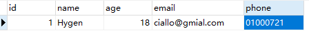

# LangGraph中的Router使用场景

## 1. Router的基本概念

在`LangGraph`中，我们可以利用"条件边"这一概念来指导或约束大模型在处理特定任务时的逻辑流程。这种机制允许大模型在达到某一环节并满足预设条件时，根据不同的条件输出或数据，选择性地执行不同的逻辑路径。


为了管理这样复杂的图结构，`LangGraph`使用的是一个类似于 `if-else`语句的结构组件，称为`Router`（路由）。这个组件允许大模型从一组预设的选项中选择合适的步骤来进行执行。

### 1.1 简单边 vs 条件边

对于简单的直接从节点`A`到节点`B`，我们一直使用的是`add_edge`方法：

```python
from langgraph.graph import START, StateGraph, END

def node_a(state):
    return {"x": state["x"] + 1}

def node_b(state):
    return {"x": state["x"] - 2}

builder = StateGraph(dict)

builder.add_node("node_a", node_a)
builder.add_node("node_b", node_b)

# 构建节点之间的边
builder.add_edge(START, "node_a")
builder.add_edge("node_a", "node_b")
builder.add_edge("node_b", END)

graph = builder.compile()
```

如果想选择性地路由到 1 个或多个边，则需要使用`add_conditional_edges`方法。该方法在`Graph`的基类中进行了定义：

```python
def add_conditional_edges(
    self,
    source: str,    # 起始节点
    path: Union[    # 这是一个可调用对象，其返回值决定接下来执行的节点
        Callable[..., Union[Hashable, list[Hashable]]],
        Callable[..., Awaitable[Union[Hashable, list[Hashable]]]],
        Runnable[Any, Union[Hashable, list[Hashable]]],
    ],
    path_map: Optional[Union[dict[Hashable, str], list[str]]] = None,  # 路径到节点名称的可选映射
    then: Optional[str] = None,  # 在path选择的节点之后执行的节点的名称
) -> Self:
```

### 1.2 路由函数的使用

路由函数`routing_function`接受图的当前`state`并返回一个值，根据返回值的不同，来决定路由到哪个节点：

```python
def routing_function(state):
    if state["x"] == 10:
        return "node_b"
    else:
        return "node_c"

builder.add_conditional_edges("node_a", routing_function)
```

默认情况下，`routing_function`路由函数的返回值用作将状态发送到下一个节点的名称。除此之外，还可以使用`path_map`参数，通过一个字典的数据结构将`routing_function`的输出映射到下一个节点的名称：

```python
def routing_function(state):
    if state["x"] == 10:
        return True
    else:
        return False

builder.add_conditional_edges(
    "node_a", 
    routing_function, 
    {True: "node_b", False: "node_c"}
)
```

## 2. Router的实际应用场景

一般来说，`Agent`是可以接收各种形式的输入，并通过预设的路由逻辑来确定执行的具体操作。如图所示，`Agent`的开始节点（Start）接收输入数据，这些输入可以是查询请求（例如"name: muyu, age: 18, phone: 123"或"Hello"）。根据输入的不同，流程通过`Router`函数进行决策，将不同的输入引导到正确的处理流程。


这里的核心是`Router function`，它根据输入数据的结构和内容，动态地决定下一步应该执行的节点。例如，对于具体的查询请求，`Router`决定需要访问数据库（Mysql节点），而对于简单的问候（如"Hello"），则直接返回一个响应（Response节点）。

**关键要点：**
- 在构建实际的`Agent`时，`Router function`的定义才是最关键且最重要的
- 我们需要在这个函数中，基于特定的一些格式或者标识来区分该执行哪一条分支的逻辑
- 对于消息的传递，大模型往往是通过结构化输出，引导其在响应的过程中应遵循哪种模式来工作，就类似于工具调用过程
- `Router`就很好的利用到了这个特性，通过结构化输出的特性来控制接下来的分支路径

## 3. 结构化输出的实现方式

在`LangGraph`中，实现结构化输出可以通过以下三种有效方式完成：

1. **提示工程**：指示大模型以特定格式做出回应
2. **输出解析器**：采用后处理的方法从大模型的响应中提取结构化数据
3. **工具调用**：利用一些内置工具调用功能来生成结构化输出

### 3.1 提示工程方法

直接通过提示工程让大模型生成特定格式的输出：

```python
from langchain_core.prompts import ChatPromptTemplate
from langchain_openai import ChatOpenAI

llm = ChatOpenAI(model="gpt-4o-mini")

prompt = ChatPromptTemplate.from_messages(
    [
        (
            "system",
            "Answer the user query. Wrap the output in `json`",
        ),
        ("human", "{query}"),
    ]
)

chain = prompt | llm
ans = chain.invoke({"query": "我叫Hygen，今年18岁，邮箱地址是ciallo@gmial.com，电话是01000721"})
```

直接通过提示工程让大模型生成特定格式的输出虽然是可行的，但这种方法在复杂的`Agent`构建流程中非常并不稳定。

### 3.2 提示工程 + 输出解析器

引入后处理步骤，通过输出解析器来格式化大模型生成的响应，可以提高输出的准确性和一致性：

```python
from langchain_core.messages import AIMessage
import json
import re
from typing import List

def extract_json(message: AIMessage) -> List[dict]:
    """Extracts JSON content from a string where JSON is embedded between ```json and ``` tags."""
    text = message.content
    pattern = r"\`\`\`json(.*?)\`\`\`"
    matches = re.findall(pattern, text, re.DOTALL)
    try:
        return [json.loads(match.strip()) for match in matches]
    except Exception:
        raise ValueError(f"Failed to parse: {message}")

chain = prompt | llm | extract_json
ans = chain.invoke({"query": "我叫Hygen，今年18岁，邮箱地址是ciallo@gmial.com，电话是01000721"})
```

### 3.3 内置工具方法（推荐）

在`LangGraph`中我们更常用的，且效果更好的是，直接使用其内置的工具方法：`.with_structured_output()`。

这个方法通过接受一个定义了所需输出属性的名称、类型和描述的模式作为输入，进而生成一个类似模型的 `Runnable`。不同于常规模型输出字符串或消息，这个 `Runnable` 输出一个与输入模式相匹配的对象。

可以通过几种方式指定这种架构，包括 `TypedDict` 类、`JSON Schema` 或 `Pydantic` 类。如果采用 `TypedDict` 或 `JSON Schema`，`Runnable` 将输出一个字典；若使用 `Pydantic` 类，则输出一个 `Pydantic` 对象。

## 4. 使用Pydantic做结构化输出

使用`Pydantic`去限定输出格式，可以确保所有通过此模型处理的数据都会符合指定的结构和数据类型，从而减少数据处理中的错误并增加代码的健壮性。此外，Pydantic的验证系统还会自动确保所有字段都符合预定义的格式，如果输入数据不符合预期，则会抛出错误。

### 4.1 定义Pydantic模型

```python
from typing import Optional
from pydantic import BaseModel, Field

# 定义 Pydantic 模型
class UserInfo(BaseModel):
    """Extracted user information, such as name, age, email, and phone number, if relevant."""
    name: str = Field(description="The name of the user")
    age: Optional[int] = Field(description="The age of the user")
    email: str = Field(description="The email address of the user")
    phone: Optional[str] = Field(description="The phone number of the user")
```

在这个`UserInfo`模型中：
- `name`（必需）: 存储用户的名字
- `age`（可选）: 存储用户的年龄，这是一个可选字段
- `email`（必需）: 存储用户的电子邮件地址
- `phone`（可选）: 存储用户的电话号码，这也是一个可选字段

### 4.2 使用with_structured_output

对于`.with_structured_output()`方法，如果我们希望模型返回一个 `Pydantic` 对象，只需要传入所需的 `Pydantic` 类即可：

```python
import os
from langchain_openai import ChatOpenAI

os.environ["OPENAI_API_KEY"] = "sk-xxx" # 更换为自己的api-key

llm = ChatOpenAI(
  base_url="https://api.deepseek.com/v1",
  model="deepseek-chat",
  temperature=0
)

# 使用 function_calling 方法，兼容更多模型
structured_llm = llm.with_structured_output(UserInfo, method="function_calling")
extracted_user_info = structured_llm.invoke("我叫Hygen，今年18岁，邮箱地址是ciallo@gmial.com，电话是01000721")
print(extracted_user_info)
```
运行结果：
```
name='Hygen' age=18 email='ciallo@gmial.com' phone='01000721'
```

它返回的是一个`UserInfo`的`Pydantic`对象，每个字段中则填充了在原始非结构化文本中提取出来的结构化信息。

### 4.3 在Router Function中使用

经过这样的格式化输出，对于`Router function`中，我们就可以通过类似这样的伪代码去继续路由分支的选择：

```python
if isinstance(extracted_user_info, UserInfo):
    print("执行节点A的逻辑")
else:
    print("执行节点B的逻辑")
```

这就是结构化输出对于`LangGraph`中路由函数逻辑判断的意义所在。

## 5. 使用TypedDict做结构化输出

如果不想使用 `Pydantic`去明确地验证输出参数，则可以使用 `TypedDict` 类定义结构化输出的模式。这就可以使用特殊`Annotated`语法，添加对指定字段的默认值和描述：

```python
from typing import Optional
from typing_extensions import Annotated, TypedDict

# 定义 TypedDict 模型
class UserInfo(TypedDict):
    """Extracted user information from text"""
    name: Annotated[str, ..., "The user's name"]
    age: Annotated[Optional[int], None, "The user's age"]
    email: Annotated[str, ..., "The user's email address"]
    phone: Annotated[Optional[str], None, "The user's phone number"]

structured_llm = llm.with_structured_output(UserInfo, method="function_calling")
extracted_user_info = structured_llm.invoke("我叫Hygen，今年18岁，邮箱地址是ciallo@gmial.com，电话是01000721")
```

使用 `TypedDict` 创建的"对象"实际上是一个字典。它没有`Pydantic`模型那样的方法和属性，因此功能相对简单。`TypedDict` 主要用于静态类型检查，但它不会在运行时进行类型检查，但搭配着`LangGraph`中已实现的基本验证机制，也是一种不错的方法。

## 6. 使用JSON Schema做结构化输出

对于`Json Schema`格式大家应该最为熟悉，不需要导入或类，可以直接通过字典的形式清楚地准确记录每个参数，但代价是代码会更加冗长：

```python
# 定义 JSON Schema
json_schema = {
    "title": "user_info",
    "description": "Extracted user information",
    "type": "object",
    "properties": {
        "name": {
            "type": "string",
            "description": "The user's name",
        },
        "age": {
            "type": "integer",
            "description": "The user's age",
            "default": None,
        },
        "email": {
            "type": "string",
            "description": "The user's email address",
        },
        "phone": {
            "type": "string",
            "description": "The user's phone number",
            "default": None,
        },
    },
    "required": ["name", "email"],
}

structured_llm = llm.with_structured_output(UserInfo, method="function_calling")
extracted_user_info = structured_llm.invoke("我叫Hygen，今年18岁，邮箱地址是ciallo@gmial.com，电话是01000721")
```

## 7. 结合结构化输出构建路由图

三种不同的结构化输出方法，我们更常使用的是用`Pydantic`来处理路由决策。在这种策略下，我们可以通过定义一个包含`Union`类型属性的父模型来灵活地从多种模式中选择适当的路由分支。

### 7.1 定义Union类型的响应模型

例如，如果我们想根据输出决定是查询数据库还是直接回答问题，可以创建一个统一的模型来封装可能的输出类型：

```python
from typing import Union, Optional
from pydantic import BaseModel, Field

# 定义数据库插入的用户信息模型
class UserInfo(BaseModel):
    """Extracted user information, such as name, age, email, and phone number, if relevant."""
    name: str = Field(description="The name of the user")
    age: Optional[int] = Field(description="The age of the user")
    email: str = Field(description="The email address of the user")
    phone: Optional[str] = Field(description="The phone number of the user")

# 定义正常生成模型回复的模型
class ConversationalResponse(BaseModel):
    """Respond to the user's query in a conversational manner. Be kind and helpful."""
    response: str = Field(description="A conversational response to the user's query")

# 定义最终响应模型，可以是用户信息或一般响应
class FinalResponse(BaseModel):
    final_output: Union[UserInfo, ConversationalResponse]
```

这个扩展后的代码将用于提取和存储用户的基本信息的`UserInfo`模型与用于生成面向用户的交流响应的`ConversationalResponse`模型统一的放在了`FinalResponse`模型中，使用`Union`类型来支持灵活的输出选项。

### 7.2 构建完整的路由图

#### 7.2.1 定义节点函数

首先，定义`Pydantic`模型以及用于生成格式化输出的大模型实例：

```python
import os
from langchain_openai import ChatOpenAI

os.environ["OPENAI_API_KEY"] = "sk-xxx" # 输入自己的api-key

llm = ChatOpenAI(
  base_url="https://api.deepseek.com/v1",
  model="deepseek-chat",
  temperature=0
)
```

定义路由节点函数，将用户输入的文本转化成格式化输出：

```python
def chat_with_model(state):
  """generate structured output"""
  messages = state['messages']
  structured_llm = llm.with_structured_output(FinalResponse, method="function_calling")
  response = structured_llm.invoke(messages)
  return {"messages": [response]}
```

连接数据库并创建表
```python
from sqlalchemy import create_engine, Table, Column, Integer, String, MetaData, text
from sqlalchemy.orm import declarative_base, sessionmaker


# 创建基类
Base = declarative_base()

# 定义 UserInfo 模型
class User(Base):
  __tablename__ = 'users'
  id = Column(Integer, primary_key=True)
  name = Column(String(50))
  age = Column(Integer)
  email = Column(String(100))
  phone = Column(String(15))

# 数据库连接配置
# 格式：mysql+pymysql://用户名:密码@主机:端口/数据库名?charset=utf8mb4
# 本地连接说明：
# - 用户名：你的 MySQL 用户名（默认通常是 root）
# - 密码：你的 MySQL 密码
# - 主机：localhost 或 127.0.0.1（本地连接）
# - 端口：3306（MySQL 默认端口，如果使用默认端口可以省略）
# - 数据库名：要连接的数据库名称
# - charset=utf8mb4：设置字符集为 utf8mb4，支持更广泛的 Unicode 字符

# MySQL 连接信息（不包含数据库名，用于创建数据库）
MYSQL_USER = 'root'
MYSQL_PASSWORD = '123456'
MYSQL_HOST = 'localhost'
MYSQL_PORT = '3306'
DATABASE_NAME = 'langgraph_agent'

# 先连接到 MySQL 服务器（不指定数据库），用于创建数据库
server_uri = f'mysql+pymysql://{MYSQL_USER}:{MYSQL_PASSWORD}@{MYSQL_HOST}:{MYSQL_PORT}?charset=utf8mb4'
server_engine = create_engine(server_uri, echo=False)

# 创建数据库（如果不存在）
with server_engine.connect() as conn:
    conn.execute(text(f"CREATE DATABASE IF NOT EXISTS `{DATABASE_NAME}` CHARACTER SET utf8mb4 COLLATE utf8mb4_unicode_ci"))
    conn.commit()

# 连接到指定的数据库
DATABASE_URI = f'mysql+pymysql://{MYSQL_USER}:{MYSQL_PASSWORD}@{MYSQL_HOST}:{MYSQL_PORT}/{DATABASE_NAME}?charset=utf8mb4'
engine = create_engine(DATABASE_URI, echo=True)

# 如果表不存在，则创建表
Base.metadata.create_all(engine)

# 创建会话
Session = sessionmaker(bind=engine)
session = Session()
```

然后分别定义两个分支节点，其中`final_answer`用于直接生成响应，而`insert_db`用于执行数据库插入操作：

```python
def final_answer(state):
  """generate natural language responses"""
  messages = state['messages'][-1]
  response = messages.final_output.response
  return {"messages": [response]}

def insert_db(state):
  """Insert user information into the database"""
  session = Session() # 确保为每次操作创建新的会话
  try:
    result = state['messages'][-1]
    output = result.final_output
    user = User(name=output.name, age=output.age, email=output.email, phone=output.phone)
    session.add(user)
    session.commit()
    return {"messages": [f"数据已成功存储至Mysql数据库。"]}
  except Exception as e:
    session.rollback()  # 出错时回滚
    return {"messages": [f"数据存储失败，错误原因：{e}"]}
  finally:
    session.close()  # 关闭会话
```

#### 7.2.2 定义Router Function

定义`generate_branch`函数作为`Router Function`，根据经过`chat_with_model`节点后产生的不同`Pydantic`对象，选择连接不同的节点：

```python
from langchain_core.messages import AnyMessage
from typing_extensions import TypedDict, Annotated
import operator

class AgentState(TypedDict):
  messages: Annotated[list[AnyMessage], operator.add]

def generate_branch(state: AgentState):
  result = state['messages'][-1]
  output = result.final_output
  if isinstance(output, UserInfo):
    return True
  elif isinstance(output, ConversationalResponse):
    return False
```

#### 7.2.3 构建图结构

构建图并使用条件边来生成`Router`：

```python
from langgraph.graph import StateGraph

graph = StateGraph(AgentState)

graph.add_node("chat_with_model", chat_with_model)
graph.add_node("final_answer", final_answer)
graph.add_node("insert_db", insert_db)

graph.set_entry_point("chat_with_model")

graph.add_conditional_edges(
  "chat_with_model",
  generate_branch,
  {True: "insert_db", False: "final_answer"}
)

graph.set_finish_point("final_answer")
graph.set_finish_point("insert_db")

graph = graph.compile()
```

#### 7.2.4 测试路由图

测试执行插入数据库的条件分支：

```python
from langchain_core.messages import HumanMessage

query = "我叫Hygen，今年18岁，邮箱地址是ciallo@gmial.com，电话是01000721"
input_message = {"messages": [HumanMessage(content=query)]}
result = graph.invoke(input_message)
print(result)
```
运行结果：
```
{'messages': [HumanMessage(content='我叫Hygen，今年18岁，邮箱地址是ciallo@gmial.com，电话是01000721', additional_kwargs={}, response_metadata={}), FinalResponse(final_output=UserInfo(name='Hygen', age=18, email='ciallo@gmial.com', phone='01000721')), '数据已成功存储至Mysql数据库。']}
```
去查看本地数据库可以看到确实有新的数据插入：



而如果正常的问答，则会经过`final_answer`直接生成响应：

```python
query = "你好，请你介绍一下你自己"
input_message = {"messages": [HumanMessage(content=query)]}
result = graph.invoke(input_message)
print(result)
```
运行结果：
```
{'messages': [HumanMessage(content='你好，请你介绍一下你自己', additional_kwargs={}, response_metadata={}), FinalResponse(final_output=ConversationalResponse(response='你好！我是一个AI助手，专门设计来帮助用户处理各种任务和回答问题。我可以协助您进行信息查询、文本处理、数据分析等
多种工作。如果您有任何需要帮助的地方，请随时告诉我，我会尽力为您提供支持！')), '你好！我是一个AI助手，专门设计来帮助用户处理各种任务和回答问题。我可以协助您进行信息查询、文本处理、数据分析等多种工作。如果您有任何需要帮助的地方，请随时告诉我，我会尽力为您提供支持！']}
```
## 8. Router Agent的优势与局限

### 8.1 优势

`Router Agent`（路由代理）的优势就是可以精准的控制程序链路中的每一个细节，通过预定义的分支结构，可以根据用户的输入请求灵活适配不同的场景。

在这个过程中，结构化输出对于路由至关重要，因为它们确保系统可以可靠地解释大模型的决定并采取行动。

### 8.2 局限

同时，这也表现出来了这是一种相对有限的控制级别的代理架构，因为大模型通常只能控制单个决策。

想象一下上面的场景中，如果我们希望定义的`insert_db`不仅仅只是包含插入数据库，而是有一堆各式各样的工具，比如网络搜索，RAG等等，应该如何进一步的扩展呢？难道要做对每一个工具在`insert_db`节点下再通过`Router Function`做分支判断吗？虽然可行，但总归并不是高效的做法。

由此，我们接下来进一步介绍`Tool Calling Agent`（工具调用代理）来高效的解决这一问题。

## 9. 核心要点总结

### 9.1 Router的核心机制

1. **条件边（Conditional Edges）**：`LangGraph`使用`add_conditional_edges`方法实现条件路由
2. **路由函数（Router Function）**：接受当前状态，返回下一个节点的标识
3. **路径映射（Path Map）**：可选参数，将路由函数的返回值映射到节点名称

### 9.2 结构化输出的重要性

1. **三种实现方式**：提示工程、输出解析器、工具调用（`.with_structured_output()`）
2. **三种模式**：Pydantic、TypedDict、JSON Schema
3. **推荐使用**：Pydantic + `.with_structured_output()`方法，效果最好且最稳定

### 9.3 路由图构建流程

1. **定义数据模型**：使用Pydantic定义结构化输出模型
2. **创建节点函数**：包括路由节点和分支节点
3. **定义Router Function**：根据结构化输出判断路由方向
4. **构建图结构**：使用`add_conditional_edges`添加条件边
5. **测试验证**：使用不同输入测试路由逻辑

### 9.4 实践建议

1. **Router Function设计**：这是最关键的部分，需要基于特定格式或标识来区分分支逻辑
2. **结构化输出**：充分利用大模型的结构化输出特性来控制分支路径
3. **Union类型**：使用Union类型支持多种输出模式，提高灵活性
4. **逐步扩展**：从简单的路由开始，逐步添加复杂的分支逻辑

## 10. 学习要点

通过本节的学习，需要掌握：

1. ✅ 理解Router的基本概念和条件边机制
2. ✅ 掌握`add_conditional_edges`方法的使用
3. ✅ 了解三种结构化输出的实现方式
4. ✅ 熟练使用Pydantic、TypedDict、JSON Schema做结构化输出
5. ✅ 能够结合结构化输出构建完整的路由图
6. ✅ 理解Router Agent的优势与局限

---

**注意**：Router是LangGraph中实现智能路由决策的核心机制，结构化输出是Router Function实现的关键技术。掌握这些内容，是构建复杂AI Agent应用的重要基础。