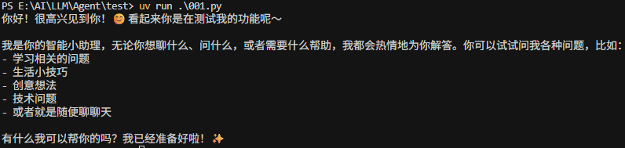
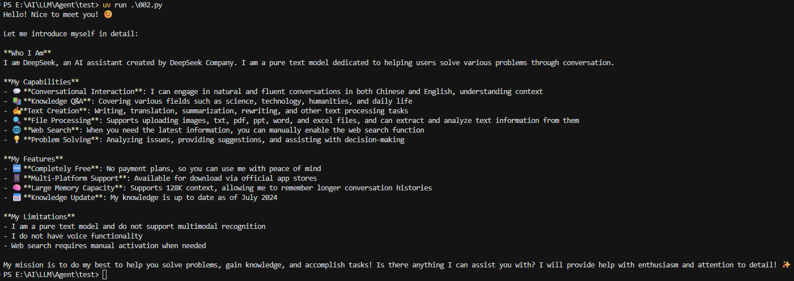

# 1. 概述

本博客内容主要介绍如何将大模型集成到`LangGraph`框架中，构建一个有应用价值的问答流程。通过学习，我们可以：

- 了解如何在`LangGraph`中集成大语言模型
- 掌握构建问答流程的完整步骤
- 学习如何扩展图结构以实现更复杂的功能

# 2. 大模型接入方式

## 2.1. 模型支持

`LangGraph`对目前主流的在线或开源模型均支持接入，包括：

- **在线模型**：OpenAI GPT系列、Anthropic Claude等
- **开源模型**：GLM4、LLaMA3、Qwen等

## 2.2. 接入方式

可以通过以下方式将大模型集成到`LangGraph`中：

1. **使用LangChain框架**：通过`LangChain`提供的接口（如`ChatOpenAI`）接入
2. **原生API方式**：直接使用大模型的原生API接口
3. **推理加速库**：利用`Ollama`、`vLLM`等推理加速库实现高效集成

> **参考文档**：
> - LangChain Chat集成：https://python.langchain.com/docs/integrations/chat/
> - LangChain LLM集成：https://python.langchain.com/docs/integrations/llms/

# 3. 基础问答流程构建

## 3.1. 定义图模式

首先需要定义图的状态模式，包括输入状态、输出状态和整体状态：

```python
from langgraph.graph import StateGraph
from typing_extensions import TypedDict
from langgraph.graph import START, END

# 定义输入的模式
class InputState(TypedDict):
    question: str

# 定义输出的模式
class OutputState(TypedDict):
    answer: str

# 将 InputState 和 OutputState 这两个 TypedDict 类型合并成一个更全面的字典类型
class OverallState(InputState, OutputState):
    pass
```

**关键点说明**：

- `InputState`：定义用户输入的格式，包含`question`字段
- `OutputState`：定义系统输出的格式，包含`answer`字段
- `OverallState`：通过多重继承合并输入和输出状态，形成完整的状态定义

## 3.2. 创建LLM节点

创建一个节点函数，用于接收用户问题并调用大模型生成回答：

```python
from langchain_openai import ChatOpenAI
from langchain_core.prompts import ChatPromptTemplate
import getpass
import os

# 设置API密钥
if not os.environ.get("OPENAI_API_KEY"):
    os.environ["OPENAI_API_KEY"] = getpass.getpass("Enter your OpenAI API key: ")

def llm_node(state: InputState):
    messages = [
        ("system", "你是一位乐于助人的智能小助理"),
        ("human", state["question"])
    ]
    
    llm = ChatOpenAI(model="gpt-4o", temperature=0)
    response = llm.invoke(messages)
    
    return {"answer": response.content}
```

**节点函数特点**：

1. **输入参数**：接收`state: InputState`作为第一个位置参数
2. **消息构建**：使用系统提示词和用户问题构建消息列表
3. **模型调用**：使用`ChatOpenAI`调用GPT-4o模型
4. **返回值**：返回包含`answer`字段的字典，更新图状态

## 3.3. 构建图结构

将节点添加到图中，并建立节点间的连接关系：

```python
# 明确指定它的输入和输出数据的结构或模式
builder = StateGraph(OverallState, input=InputState, output=OutputState)

# 添加节点
builder.add_node("llm_node", llm_node)

# 添加边
builder.add_edge(START, "llm_node")
builder.add_edge("llm_node", END)

# 编译图
graph = builder.compile()
```

**图结构说明**：

- `StateGraph`初始化时指定了状态模式、输入模式和输出模式
- `add_node`方法添加节点，第一个参数是节点名称，第二个参数是节点函数
- `add_edge`方法添加边，连接`START` → `llm_node` → `END`
- `compile`方法编译图，验证图结构的合法性

## 3.4. 执行测试

使用`invoke`方法调用图，传入用户问题：

```python
# 基础测试
result = graph.invoke({"question": "你好，我用来测试"})
print(result["answer"])

# 详细问题测试
result = graph.invoke({"question": "你好，请你详细的介绍一下你自己"})
print(result["answer"])
```

**执行流程**：

1. 用户输入通过`START`节点进入图
2. `llm_node`节点接收问题，调用大模型生成回答
3. 结果通过`END`节点返回给用户

# 4. 扩展：多节点问答流程

## 4.1. 扩展状态定义

为了支持多节点间的数据传递，需要扩展状态定义：

```python
from typing_extensions import TypedDict, Optional

# 定义输入的模式
class InputState(TypedDict):
    question: str
    llm_answer: Optional[str]  # 表示 llm_answer 可以是 str 类型，也可以是 None

# 定义输出的模式
class OutputState(TypedDict):
    answer: str

# 将 InputState 和 OutputState 这两个 TypedDict 类型合并成一个更全面的字典类型
class OverallState(InputState, OutputState):
    pass
```

**关键变化**：

- 添加了`llm_answer`字段，用于存储中间节点的输出结果
- 使用`Optional[str]`表示该字段可以为`None`，提供灵活性

## 4.2. 创建多个节点

定义两个节点：一个用于生成回答，另一个用于翻译：

```python
def llm_node(state: InputState):
    messages = [
        ("system", "你是一位乐于助人的智能小助理"),
        ("human", state["question"])
    ]
    
    llm = ChatOpenAI(model="gpt-4o", temperature=0)
    response = llm.invoke(messages)
    
    return {"llm_answer": response.content}

def action_node(state: InputState):
    messages = [
        ("system", "无论你接收到什么语言的文本，请翻译成法语"),
        ("human", state["llm_answer"])
    ]
    
    llm = ChatOpenAI(model="gpt-4o", temperature=0)
    response = llm.invoke(messages)
    
    return {"answer": response.content}
```

**节点功能说明**：

- `llm_node`：接收用户问题，生成中文回答，并将结果存储在`llm_answer`字段
- `action_node`：接收`llm_answer`，将其翻译成法语，并将结果存储在`answer`字段

## 4.3. 构建多节点图结构

将两个节点添加到图中，并建立连接：

```python
# 明确指定它的输入和输出数据的结构或模式
builder = StateGraph(OverallState, input=InputState, output=OutputState)

# 添加节点
builder.add_node("llm_node", llm_node)
builder.add_node("action_node", action_node)

# 添加边
builder.add_edge(START, "llm_node")
builder.add_edge("llm_node", "action_node")
builder.add_edge("action_node", END)

# 编译图
graph = builder.compile()
```

**图结构流程**：

```
START → llm_node → action_node → END
```

**执行流程**：

1. 用户问题通过`START`进入`llm_node`
2. `llm_node`生成中文回答，更新`llm_answer`字段
3. `action_node`读取`llm_answer`，翻译成法语，更新`answer`字段
4. 最终结果通过`END`返回

## 4.4. 测试多节点流程

```python
# 测试自我介绍翻译
result = graph.invoke({"question": "你好，请你详细的介绍一下你自己"})
print(result["answer"])

# 测试知识问答翻译
result = graph.invoke({"question": "请问什么是人工智能？"})
print(result["answer"])
```

# 5. 实测代码(基于Deepseek)
## 5.1. 单Agent流程
```python
from langgraph.graph import StateGraph
from typing_extensions import TypedDict
from langgraph.graph import START, END

# 1. 创建图模式
# 为什么参数是TypedDict？
# TypedDict是Python中的一个类型，用于定义字典的类型。
# 它可以帮助我们定义字典的键和值的类型，从而避免在运行时出现类型错误。
class InputState(TypedDict):
  question: str

class OutputState(TypedDict):
  answer: str

# pass 和 ... 的区别
# pass 是一个占位符，表示什么也不做。
# ... 表示一个空字典。
class OverallState(InputState, OutputState):
  pass

# 2. 创建节点函数
# 获取api key
import os
from langchain_openai import ChatOpenAI
from langchain_core.prompts import ChatPromptTemplate
from langchain_core.messages import SystemMessage, HumanMessage

# 设置api key，这边直接配置了key，要科学保密可以使用dotenv来进行配置
os.environ["OPENAI_API_KEY"] = "sk-xxx" # 填自己的api-key


def llm_node(state: OverallState) -> OverallState:
  messages = [
    SystemMessage(content="你是一位乐于助人的智能小助理"),
    HumanMessage(content=state["question"])
  ]
  llm = ChatOpenAI(
    model="deepseek-chat", 
    temperature=0,
    base_url="https://api.deepseek.com/v1"
  )
  response = llm.invoke(messages)
  return {"answer": response.content}

# 3. 创建图结构
builder = StateGraph(OverallState, input_schema=InputState, output_schema=OutputState)
builder.add_node("llm_node", llm_node)
builder.add_edge(START, "llm_node")
builder.add_edge("llm_node", END)

# 4. 编译图
graph = builder.compile()

# 5. 执行图
result = graph.invoke({"question": "你好，我用来测试"})
print(result["answer"])
```
运行截图：

## 5.2. 多Agent流程
```python
import os
from typing import Optional
from typing_extensions import TypedDict
from langchain_openai import ChatOpenAI
from langchain_core.messages import SystemMessage, HumanMessage
from langgraph.graph import StateGraph, START, END

class InputState(TypedDict):
  question: str
  llm_answer: Optional[str]

class OutputState(TypedDict):
  answer: str

class OverallState(InputState, OutputState):
  pass

os.environ["OPENAI_API_KEY"] = "sk-xxx" # 修改为自己的api-key

def llm_node(state: OverallState) -> OverallState:
  messages = [
    SystemMessage(content="你是一位乐于助人的智能小助理"),
    HumanMessage(content=state["question"])
  ]
  llm = ChatOpenAI(
    model="deepseek-chat", 
    temperature=0,
    base_url="https://api.deepseek.com/v1"
  )
  response = llm.invoke(messages)
  return {"llm_answer": response.content}

def action_node(state: OverallState) -> OverallState:
  messages = [
    SystemMessage(content="请将你接收到的文本翻译为用英文"),
    HumanMessage(content=state["llm_answer"])
  ]
  llm = ChatOpenAI(
    model="deepseek-chat", 
    temperature=0,
    base_url="https://api.deepseek.com/v1"
  )
  response = llm.invoke(messages)
  return {"answer": response.content}

builder = StateGraph(OverallState, input_schema=InputState, output_schema=OutputState)
builder.add_node("llm_node", llm_node)
builder.add_node("action_node", action_node)
builder.add_edge(START, "llm_node")
builder.add_edge("llm_node", "action_node")
builder.add_edge("action_node", END)
graph = builder.compile()
result = graph.invoke({"question": "你好，请你详细的介绍一下你自己"})
print(result["answer"])
```
运行截图：

# 6. 核心要点总结

## 6.1. LangGraph的灵活性

1. **节点函数自主性**：
   - 可以在节点函数中定义任意逻辑
   - 可以自主构建中间状态信息
   - 不强制依赖`LangChain`框架

2. **状态管理**：
   - 节点可以读取和写入图状态中的任何字段
   - 状态在节点间自动传递和更新
   - 通过`TypedDict`确保类型安全

3. **图结构扩展性**：
   - 可以轻松添加新节点
   - 通过边灵活控制执行流程
   - 支持复杂的多节点工作流

## 6.2. 与LangChain的关系

- **基于LangChain**：`LangGraph`基于`LangChain`的表达式语言构建
- **可独立运行**：虽然基于`LangChain`，但完全可以脱离`LangChain`独立运行
- **模型接入灵活**：可以使用`LangChain`接口，也可以使用原生API

## 6.3. 实践建议

1. **理解状态模式**：深入理解`TypedDict`的作用和状态传递机制
2. **节点函数设计**：合理设计节点函数，确保输入输出格式正确
3. **图结构规划**：在构建图之前，先规划好节点和边的连接关系
4. **逐步扩展**：从简单流程开始，逐步添加复杂功能

# 7. 学习要点

通过本节的学习，需要掌握：

1. ✅ 如何在`LangGraph`中定义图的状态模式
2. ✅ 如何创建节点函数并集成大语言模型
3. ✅ 如何构建图结构并建立节点间的连接
4. ✅ 如何执行图并获取结果
5. ✅ 如何扩展图结构以实现多节点工作流
6. ✅ 理解节点间状态传递的机制

# 8. 下一步学习方向

掌握了基础的问答流程构建后，可以进一步学习：

- **条件边（Conditional Edges）**：根据条件动态选择执行路径
- **循环图（Cyclic Graphs）**：实现循环和迭代逻辑
- **状态持久化**：保存和恢复图执行状态
- **人机交互**：在图中插入人工审核节点
- **流式输出**：实现实时流式响应

---

**注意**：本节示例虽然不复杂，但涉及的知识点和细节较多。建议亲自尝试和体验，打好扎实的基础，才能更好地开展后续复杂循环图的学习。