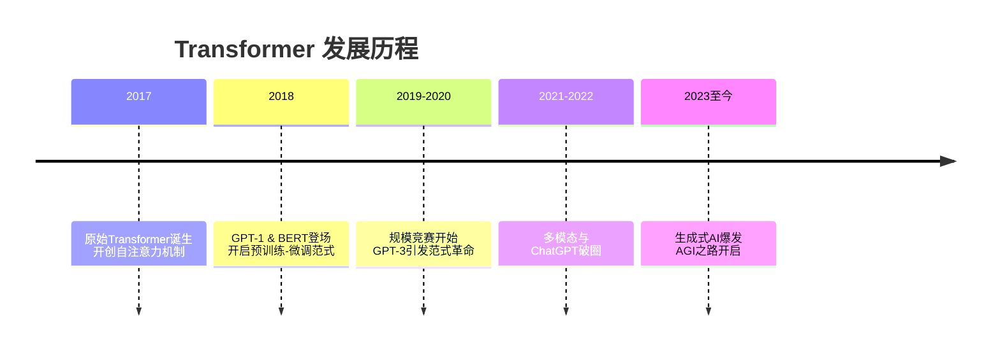

# 1. NLP是什么？
NLP(Normal Language Process)即常见的自然语言处理，它是目前AI最热门的领域之一，旨在让计算机能够**理解、解释和生成人类语言**。

用更简单的话来说，NLP就是**教计算机读懂、听懂并说人话**的技术。
## NLP的两大核心任务
1.  **自然语言理解**：让计算机**理解**人类语言的含义。
    *   *例子*：当你对智能音箱说“今天天气怎么样？”，它能理解你是在询问天气信息。

2.  **自然语言生成**：让计算机根据信息**生成**通顺的人类语言文本。
    *   *例子*：天气预报系统根据数据自动生成“今天晴转多云，气温25-30度”的文本。

NLP技术已经深入我们生活的方方面面，例如智能语音助手、智能客服机器人、机器翻译等。
## NLP核心技术简介
*   **词向量**：将文字转换为计算机能处理的数字向量，同时保留语义信息。
*   **循环神经网络/Transformer模型**：处理序列数据的强大模型，Transformer是目前的主流架构。
*   **预训练语言模型**：如BERT、GPT系列等。这些模型在大量文本数据上进行预训练，学会了语言的通用规律，然后可以针对特定任务（如翻译、问答）进行微调，效果非常出色。

# 2. Transformer之前NLP的瓶颈？
在Transformer出现之前，NLP领域的主流是基于`RNN/LSTM`的序列模型。它们虽然强大，但其顺序处理的天性导致了**并行化能力差**和**长程依赖建模能力不足**这两个核心瓶颈。

正是为了突破这些瓶颈，Transformer模型应运而生。 它通过**自注意力机制**和**完全并行化**的架构，一举解决了以上所有问题，成为了NLP领域真正的游戏规则改变者。
# 3. Transformer的地位和发展历程
## **Transformer的核心地位**

1.  **基石模型**：Transformer 不仅是众多最先进NLP模型的**基础架构**，更是整个 **“大语言模型时代”的基石**。没有Transformer，就没有今天的GPT、BERT、T5等系列模型。

2.  **技术范式的革命**：它通过 **“自注意力机制”** 完全取代了过去的RNN和CNN在序列建模中的核心地位，解决了**长程依赖**和**并行化困难**两大瓶颈。

3.  **领域的统一者**：Transformer的出现，使得NLP领域几乎所有任务（翻译、摘要、问答等）都可以使用同一种核心架构来解决，只是输入输出和微调方式不同，实现了技术路线的统一。

4.  **边界的拓展者**：其影响力已远超NLP，在**计算机视觉、语音识别、生物信息学**等领域都取得了巨大成功，成为了跨模态的通用 backbone 架构。

---

## **Transformer的发展历程**

### **关键节点详解**

*   **2017：诞生——《Attention is All You Need》**
    *   谷歌发布这篇里程碑式的论文，首次提出了完全基于自注意力机制的Transformer架构，初衷是为了更好地完成机器翻译任务。

*   **2018：崛起——预训练模型的黎明**
    *   **GPT-1 (OpenAI)**：首次展示了基于Transformer解码器的**生成式预训练** 的强大潜力。
    *   **BERT (Google)**：基于Transformer编码器，通过**双向上下文理解** 在11项NLP任务上刷新纪录，引爆了“预训练-微调”范式。

*   **2019-2020： scaling law（规模扩展）与能力涌现**
    *   **GPT-2 & GPT-3 (OpenAI)**：沿着GPT的道路，模型参数从15亿暴增至1750亿。GPT-3展示了惊人的**少样本/零样本学习能力**，证明了“大力出奇迹”的可行性。
    *   **T5 (Google)** 等模型将所有NLP任务都统一为“文本到文本”的格式，进一步巩固了Transformer的通用性。

*   **2021-2022： 多模态与“破圈”应用**
    *   **Vision Transformer (ViT)**：证明Transformer无需CNN，直接在图像补丁上也能实现顶尖的计算机视觉效果。
    *   **DALL·E, Stable Diffusion** 等文生图模型，其核心也使用了Transformer来理解文本和生成图像。
    *   **ChatGPT (2022年底)**：基于GPT-3.5，通过指令微调和人类反馈强化学习，让Transformer模型具备了卓越的对话和指令遵循能力，引发全球性的AI热潮。

*   **2023至今： 生成式AI的爆发与AGI的探索**
    *   **GPT-4、Llama、Claude** 等模型群雄逐鹿，技术迭代飞速。
    *   模型能力从纯文本扩展到**语音、图像、视频**的多模态理解与生成。
    *   Transformer已成为探索通用人工智能的核心架构之一。
# 4. 序列模型的基本思路与根本诉求
序列数据是一种按照特定顺序排列的数据，如股票价格的历史记录、WiFi毫米波信号等。序列数据有着**样本与样本相关联**的特点，对时间序列数据而言，每个样本代表一个时间点，样本与样本之间的关联就是时间点与时间点之间的关联。而对于文本序列而言，每个字或词的语义信息就是关联的内容，要理解一个句子的含义，就必须理解样本与样本之间的关系。

序列算法的根本诉求是要建立样本与样本之间的关联，并借助这种关联提炼出对序列数据的理解。

要理解Transformer模型的本质，首先我们要回归到序列数据、序列模型这些基本概念上来。序列数据是一种按照特定顺序排列的数据，它在现实世界中无处不在，例如股票价格的历史记录、语音信号、文本数据、视频数据等等，主要是按照某种特定顺序排列、且该顺序不能轻易被打乱的数据都被称之为是序列数据。序列数据有着“样本与样本有关联”的特点；对时间序列数据而言，每个样本就是一个时间点，因此样本与样本之间的关联就是时间点与时间点之间的关联。对文字数据而言，每个样本就是一个字/一个词，因此样本与样本之间的关联就是字与字之间、词与词之间的语义关联。很显然，要理解一个时间序列的规律、要理解一个完整的句子所表达的含义，就必须要理解样本与样本之间的关系。

对于一般表格类数据，我们一般重点研究特征与标签之间的关联，但**在序列数据中，众多的本质规律与底层逻辑都隐藏在其样本与样本之间的关联中**，这让序列数据无法适用于一般的机器学习与深度学习算法。这是我们要创造专门处理序列数据的算法的根本原因。在深度学习与机器学习的世界中，**序列算法的根本诉求是要建立样本与样本之间的关联，并借助这种关联提炼出对序列数据的理解**。唯有找出样本与样本之间的关联、建立起样本与样本之间的根本联系，序列模型才能够对序列数据实现分析、理解和预测。

在机器学习和深度学习的世界当中，存在众多经典且有效的序列模型。这些模型通过如下的方式来建立样本与样本之间的关联
- ARIMA家族算法群
> 过去影响未来，因此未来的值由过去的值加权求和而成，以此构建样本与样本之间的关联。

$$AR模型：y_t = c + w_1 y_{t-1} + w_2 y_{t-2} + \dots + w_p y_{t-p} + \varepsilon_t$$

- 循环网络家族
> 遍历时间点/样本点，将过去的时间上的信息传递存储在中间变量中，传递给下一个时间点，以此构建样本和样本之间的关联。

$$RNN模型：h_t = W_{xh}\cdot x_t + W_{hh}\cdot h_{t-1}$$

$$LSTM模型：\tilde{C}_t = tanh(W_{xi} \cdot x_t + W_{hi} \cdot h_{t-1} + b_i)$$
- 卷积网络家族
> 使用卷积核扫描时间点/样本点，将上下文信息通过卷积计算整合到一起，以此构建样本和样本之间的关联。如下图所示，蓝绿色方框中携带权重$w$，权重与样本值对应位置元素相乘相加后生成标量，这是一个加权求和过程。

总结这些序列算法的经验，可以发现它们都是在用**加权求和**的方式来建立样本与样本之间的关联，因此在序列算法的发展过程中，核心问题已经由**如何建立样本之间的关联**转变成了**如何合理对样本进行加权求和，即权重计算方式**，在这个问题上，正如首次提出Transformer的论文名称——**Attention is All You Need**，目前最佳的权重注意力计算方式就是 **注意力机制**。