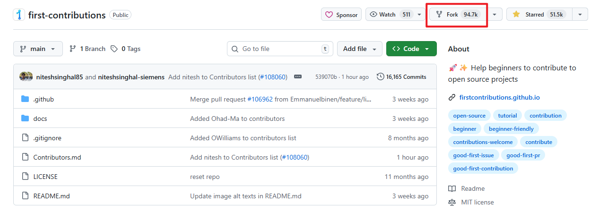
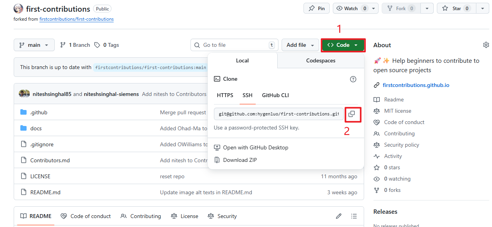
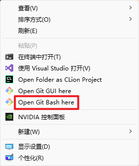
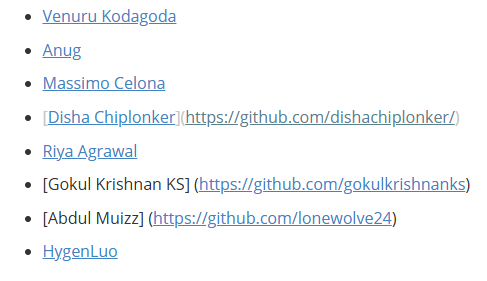
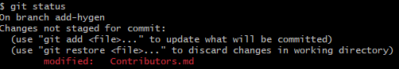
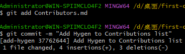
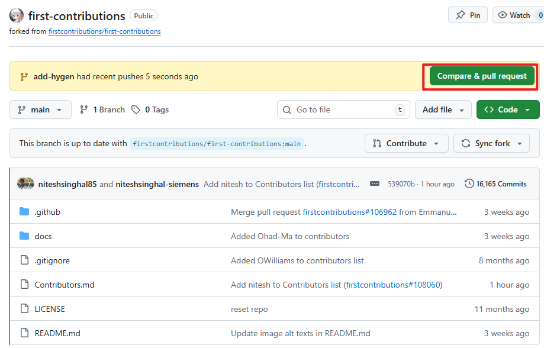

在开始之前，先确保自己的电脑里有`git`，如果没有的话需要先去[git官网](https://git-scm.com/)下载，并配置，还要先了解基础的`clone`,`add`,`commit`,`push`,`pull`等基本操作
# 开源项目选择
github中有一个开源项目是专门用于让初学者学习如何参与开源项目的，链接如下：

[first-contributions](https://github.com/firstcontributions/first-contributions)

这个开源项目的README文档中有具体的参与教程，这里直接根据这个开源项目的教程来学习如何参与开源项目

# 参与开源项目
## 1. Fork代码仓库
在进入上面的网页中后，点击右上角的`Fork`，后面的确认信息直接保持默认即可



## 2. Clone代码仓库
在得到自己的仓库后，选择将自己的库克隆到本地，注意是**自己的仓库**而不是原仓库



在本地找个文件夹右键打开`git bash`，然后在命令行中输入以下内容


```bash
git clone [复制的内容]
```
## 3. 新建代码分支
随后在`git bash`中进入仓库，并创建新的代码分支，分支名可以是`add-newbranch`，也可以是`add-hygen`，可以是任意名字，但是最好有`add-`表示添加分支
```bash
cd first-contributions
git switch -c add-newbranch
```
## 4. 修改，并提交修改
由于这是开源教程，所以没有实质性的代码修改内容，打开`Contributions.md`这个文件，在最后加上自己的名字即可



将修改提交上去前可以用`git status`先看看都有哪些修改



之后提交修改，如果要提交所有修改，就选择`git add .`，这里选择精确提交修改，`commit`处将`yourname`部分改成自己的名字即可
```bash
git add Contributions.md
git commit -m "Add <yourname> to Contributions list"
```

## 5. 将改动push到github
使用`git push`推送代码，后面同样将内容替换为自己修改的新分支名称即可
```bash
git push origin <new-branch-name>
```
example：
```bash
git push origin add-hygen
```
## 6， 提出pull request将修改供他人审阅
前往自己的仓库，有`Compare & pull request`按钮，点击即可



# 注意事项
关于正式开始后有哪些注意事项，请参考b站up主码农高天的[这期视频](https://www.bilibili.com/video/BV15C411r7uD/?spm_id_from=333.1391.0.0&vd_source=277b2219bdd7d053a64be57e1ece8b6d)