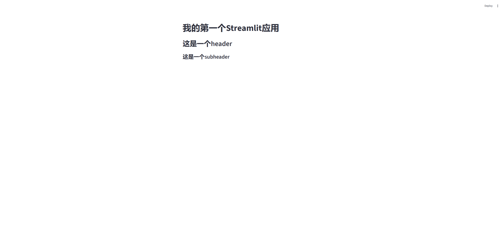

# 1. Streamlit
## 1.1. Streamlit入门
[Streamlit](https://streamlit.io) 是一个开源 Python 框架，可以用很少的代码快速把数据分析、机器学习模型或脚本做成交互式 Web 应用，无需掌握前端基础。

### 1.1.1. Streamlit入门程序步骤
1. 安装streamlit：`pip install streamlit`
2. 在python中引入streamlit模块：`import streamlit as st`
3. 基于streamlit中提供的API来构建Web应用
4. 终端中运行程序：`streamlit run xxx.py`

### 1.1.2. 入门程序示例
```python
import streamlit as st

st.title("我的第一个Streamlit应用")
st.header("这是一个header")
st.subheader("这是一个subheader")
```

运行后会在浏览器打开如下页面：
